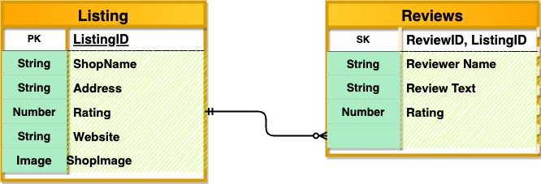
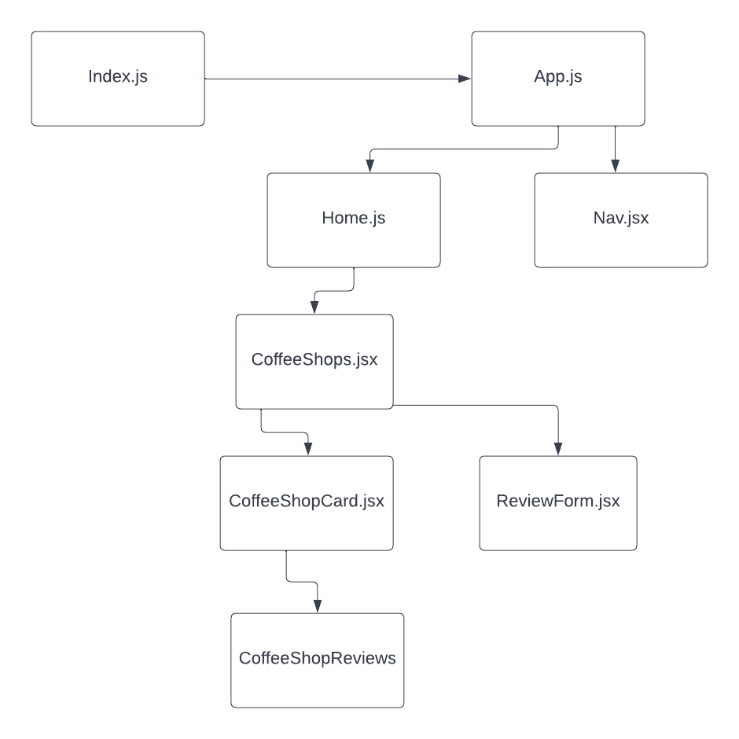

# MERN-APP
# Coffee Shop Find and Review

## Date: 10/19/2022
### By: Jeremy Harrell
#### [GitHub](https://github.com/wolfy1313) | [LinkedIn](https://www.linkedin.com/in/jeremy-harrell-67a46a229/) | [Spotify](https://open.spotify.com/artist/3orDENaFfgt5gcLk24QHSS)
***
### ***[TrelloBoard](https://trello.com/invite/b/MMl57ch5/ATTI45bc5463fac7519f90875aeda19d5433A81AC707/mern-coffee-shop-app)***

***
### ***App Overview***
#### This is an app to display favorite coffee shops and their ratings. Users will be allowed to post reviews and ratings for each shop. 
***
### ***Getting Started***
#### Users will arrive at Home Page and see the Listings section which will be clickable. That will display a page with links to different coffee shops. Each coffee shop will have it's own "card" with details. Users will be able to post reviews for each coffee shop as well as delete them. In the real world users would only be able to report others reviews and delete ones they authored.
***

## 
***

***
### ***Future Updates***
[x] REACT Creation 

[x] MONGOOSE Creation

[x] HEROKU Deployment
***
### ***Credits***

Markdown Guide: [Markdownguide.org](https://ia.net/writer/support/general/markdown-guide)

Markdown Cheatsheet: [Markdownguide.org](https://www.markdownguide.org/cheat-sheet/)

CSS Transitions Guide : [thebrandsmen.com](https://thebrandsmen.com/css-image-hover-effects/)